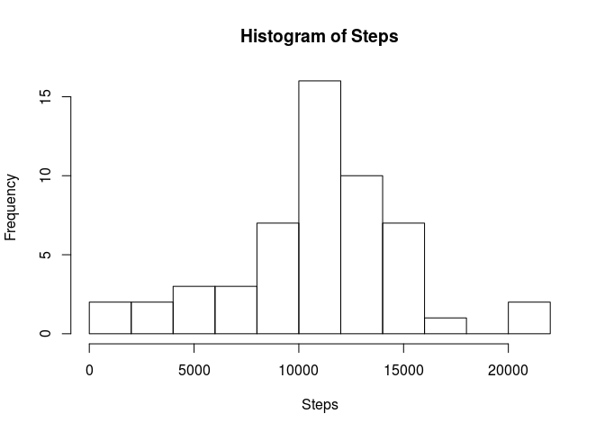
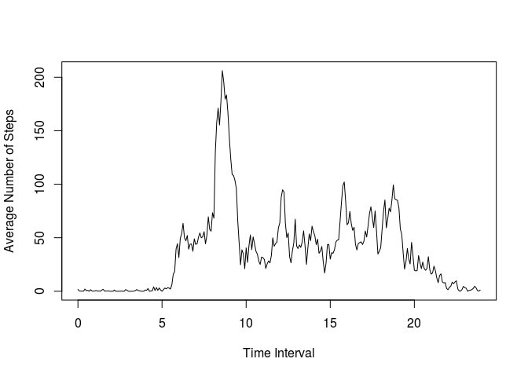
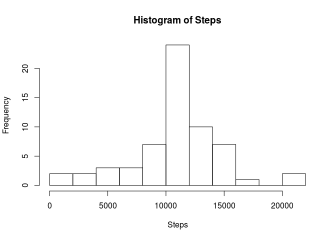
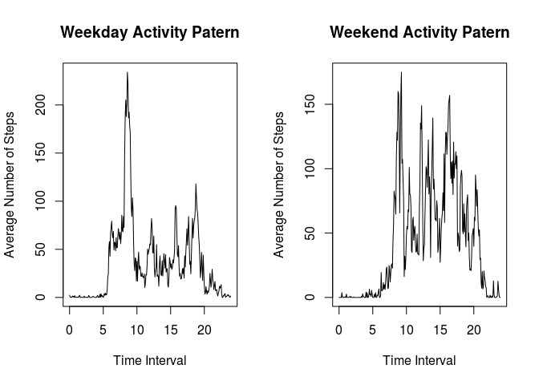

# Reproducible Research: Peer Assessment 1

## Loading and preprocessing the data

I load the data just using read.csv function. Then transform the activity interval into
hours with decimals in order to get a better plot later on. 

```r
activity <- read.csv("activity.csv")
faux <- function(x){ as.integer(x/100) + (x%%100)/60}
activity$interval <- sapply(activity$interval,faux)
```

## What is mean total number of steps taken per day?
I create a new data.frame with aggregate function that sums the number of steps over every day. 
Then I print mean and median. 

```r
steps.per.day <- aggregate(activity$steps,by=list(activity$date),sum)
names(steps.per.day) <- c("Date","Steps")
with(steps.per.day,hist(Steps,breaks=10))
```

 

```r
mean(steps.per.day$Steps,na.rm=T)
```

```
## [1] 10766.19
```

```r
median(steps.per.day$Steps, na.rm=T)
```

```
## [1] 10765
```

## What is the average daily activity pattern?
I create a new data.frame  that contains the average number of steps for each time interval. 
Then plot this new data.frame and print the interval with the maximum average number of steps. 

```r
activity.patern <- aggregate(activity$steps,by=list(activity$interval),function(x){mean(x,na.rm=T)})
names(activity.patern) <- c("Interval","Average")
plot(activity.patern,type='l', xlab = "Time Interval", ylab = "Average Number of Steps")
```

 

```r
aux <- with(activity.patern,Interval[which.max(Average)])
paste("Interval with maximum mumber of steps is the one starting at ", 
      as.integer(aux), ":", aux%%1 *60, sep="")
```

```
## [1] "Interval with maximum mumber of steps is the one starting at 8:35"
```

## Imputing missing values

We report the total number of 'NA's. Then we create a new data.set where each 
missing value is replaced by the daily average of its correspondent time interval. 
Actually, we take as number of steps the closest integer the average. 

```r
paste("Total nunber of NA values:",sum(is.na(activity$steps)))
```

```
## [1] "Total nunber of NA values: 2304"
```

```r
new.activity <- activity
for(i in which(is.na(new.activity$steps))){
  iaux <- match(new.activity$interval[i],activity.patern$Interval)
  new.activity$steps[i] <- as.integer(activity.patern$Average[iaux]+0.5)
}
```

I repeat the computation of the total number of steps per day. 


```r
new.steps.per.day <- aggregate(new.activity$steps,by=list(new.activity$date),sum)
names(new.steps.per.day) <- c("Date","Steps")
with(new.steps.per.day,hist(Steps,breaks=10))
```

 

```r
paste("Old mean =", mean(steps.per.day$Steps,na.rm=T),
      "vs New mean =", mean(new.steps.per.day$Steps))
```

```
## [1] "Old mean = 10766.1886792453 vs New mean = 10765.6393442623"
```

```r
paste("Old median =", median(steps.per.day$Steps,na.rm=T),
      "vs New median =", median(new.steps.per.day$Steps))
```

```
## [1] "Old median = 10765 vs New median = 10762"
```

We can see that the imputation has little effect on the mean. The median changes 
but to a value that is close anyway. The major effect is in the histogram, where the counts 
in the central part goes up. Probably all this is due to the fact that missing values were 
entire days of data.


## Are there differences in activity patterns between weekdays and weekends?

I create a new factor variable in the data set with two levels – “weekday” and “weekend” indicating whether a given date is a weekday or weekend day. Then I split the data into two new data sets accordingly. 


```r
faux <- function(date){ 
  if(weekdays(date) %in% c("Sunday","Saturday")) { type <- "weekend"
  }else{ type <- "weekday"}
}
activity$daytype <- as.factor(sapply(as.Date(activity$date),faux))
split.activity <- split(activity,activity$daytype)
weekday.activity <- split.activity[[1]]
weekend.activity <- split.activity[[2]]
```

Now I compute the average number of steps for each time interval, for weekdays and weekends. Then 
I plot the comparison.


```r
weekday.activity.patern <- aggregate(weekday.activity$steps, by=list(weekday.activity$interval),
                                     function(x){mean(x,na.rm=T)})
names(weekday.activity.patern) <- c("Interval","Average")
weekend.activity.patern <- aggregate(weekend.activity$steps, by=list(weekend.activity$interval),
                                     function(x){mean(x,na.rm=T)})
names(weekend.activity.patern) <- c("Interval","Average")
par(mfrow=c(1,2))  
plot(weekday.activity.patern,type='l', xlab = "Time Interval", ylab = "Average Number of Steps",
     main="Weekday Activity Patern")
plot(weekend.activity.patern,type='l', xlab = "Time Interval", ylab = "Average Number of Steps", 
     main="Weekend Activity Patern")
```

 
